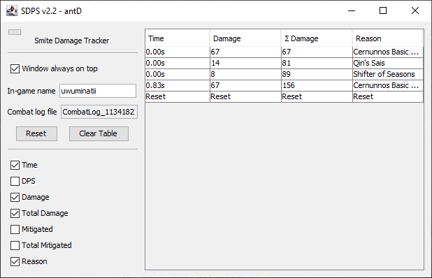
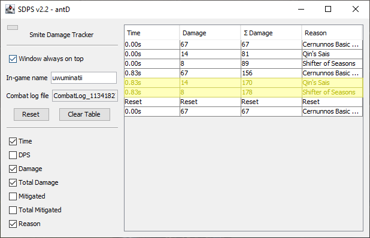

# Hidden Combat

Hidden combat is an issue that is caused by the way Smite outputs its combat log. Under certain
scenarios, the combat log will not output a line of combat and that line will be hidden until the
log is updated again. An example of this would be damage ticks that occur at the exact same time
(e.g. Qin's Sais along with its corresponding basic attack hit).

My solution to this problem was to add an indicator whenever there could be hidden combat that is
not being displayed. If there is potentially hidden combat, there will be a status message below
the table and the last row in the table will contain asterisks. There are a number of ways to
update the combat log to leave the potential hidden combat state, the easiest being to start and
cancel a recall.

If you find any issues with this system or would like to recommend a change, make a post on the
[issues page](https://github.com/antD97/SDPS/issues).

## Video Demonstration

---

# OLD TODO REMOVE

**This one is fairly important** depending on the type of scenario you are trying to measure, in
particular burst damage. If there are multiple damage ticks that occur at the same time (e.g.
Qin's Sais), Smite's combat log annoyingly won't be updated until the next combat update. The late
timing won't mess up the DPS calculation, but this issue can make the table's output misleading.
The following screenshots show an example of two ticks of damage arriving late to the DPS log.

There are two missing rows of damage from Qin's Sais and Shifter of Seasons that occurred at the
same time as the last shown basic attack. These rows are not added until the combat log is
updated with another basic attack.

Some other examples of this are Polynomicon and Bacchus' ult which counts as two combat ticks,
once for drunk effect and once for damage. Damage from these sources will appear in the table on
the next combat tick. It's difficult to tell which gods and items have this behavior so:
**whenever you want to record DPS or total damage, be sure to click "Reset" and then do another**
**tick of damage to reveal any damage ticks that may have been hidden.**
