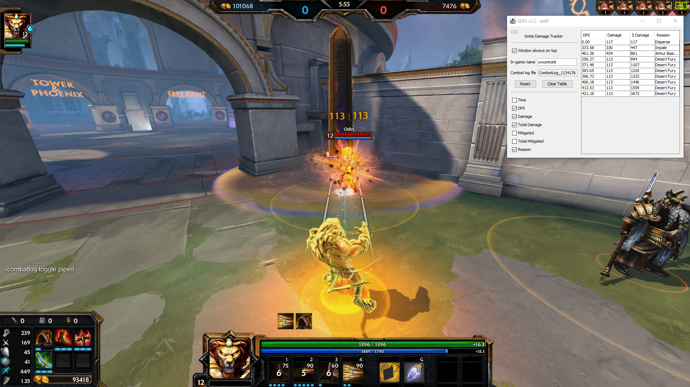
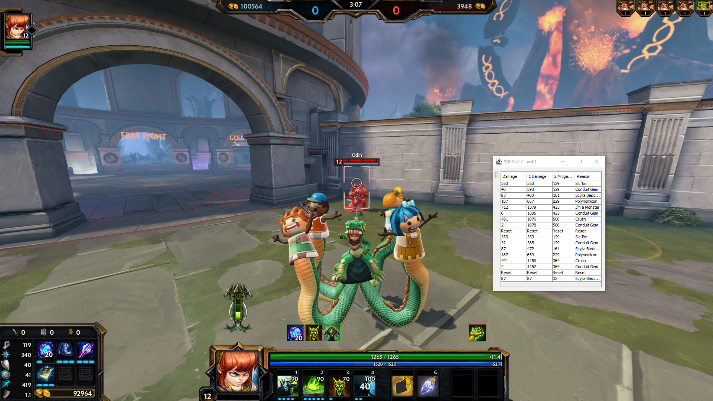

# SDPS

SDPS is a handy tool for the game [Smite](https://smitegame.com/) that lets you track your in-game
damage and healing in real time. By jumping into a jungle practice match, SDPS makes it easy to
compare different item builds. SDPS uses the in-game combat log, so it will work seamlessly with
future updates containing balance changes, new gods, and new items.

As of v2.5.0, SDPS can also be used to create a text file that can be used as an
[OBS text source](https://obsproject.com/eu/kb/text-sources). See the
[OBS Source page](doc/obs-source.md) for a demonstration and documentation.

You can find the latest download [here](https://github.com/antD97/SDPS/releases/tag/v2.5.0).

Feel free to post any questions, bug reports, and feature requests to the
[issues page](https://github.com/antD97/SDPS/issues).

## Usage

1. Extract the zip file and run `SDPS.exe` to start the tool. Windows will likely display a message
   stating "Windows protected your PC", because the file is not recognized. Click "More info" and
   then "Run anyway" to launch the tool.
2. In the Smite chat, enter `/combatlog toggle piped` to let SDPS read your combat log. This command
   has to be typed in once per game launch.
3. The first row of healing or damage will start the timer used to calculate DPS, and your DPS will
   continuously be reported every time a row is added.
4. The "Reset" button resets the total columns values and resets the DPS timer. The "Clear Table"
   button removes all rows from the table and resets tracking.
   - The "Reset" and "Clear Table" buttons do not work if the status message below the table reads
     "Potentially hidden combat". The easiest way to clear potentially hidden combat is to start
     recalling and then cancelling the recall immediately. This will update the combat log and the
     "Reset" and "Clear Table" buttons will work again. See the
     [Hidden Combat page](doc/hidden-combat.md) for a detailed explanation as to why this is
     necessary.

SDPS will try to automatically find your in-game name when the first instance of damage appears in
the combat log. If your in-game name is set incorrectly, the reset button next to the displayed name
will let you set your name again.

## Notes

- If you hover over each of the buttons and checkboxes in the window, you can reveal its shortcut.

- The small button in the top left corner can be used to collapse the settings panel.

- In the "Odin bots" section of jungle practice, there are three Odin bots to the immediate left.
  These bots are handy for DPS calculations. The first one matches your character's level, the
  second one is level one, and the third one is level twenty. There are also buttons to the right
  that let you change their protections.

- If it does not seem like your combat is being tracked, try clicking the reset button to reopen the latest
  combat log file. Also try typing in `/combatlog toggle piped` into the Smite chat again. The command only has to
  be entered once per game launch. It may have been entered twice which would turn off combat logging.

- What does potentially hidden combat mean? Why am I not able to hit reset while the row with
  asterisks is there? Rows with asterisks shows that there is potentially more combat to show
  after that row that has not appeared yet in the combat log. The easiest way to clear potentially hidden
  combat is to start recalling and then cancelling it immediately. To learn why this is necessary 
  see the [Hidden Combat page](doc/hidden-combat.md).

## Building

Using JDK 15, run `./gradlew createBundledExe`. The output is located in `build/bundledExe`.

## Screenshots

## Copyright and License

Copyright © 2021-2022 antD97
Licensed under the [MIT License](LICENSE)
