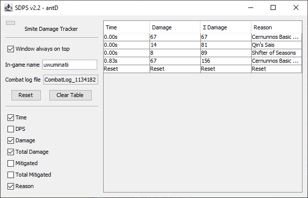

# SDPS

SDPS is a handy tool for the game [Smite](https://smitegame.com/) that lets you track your in-game
damage in real time. By jumping into a jungle practice match, SDPS makes it easy to compare the
damage of different builds. SDPS uses the in-game combat log, so it will work seamlessly with future
updates containing balance changes, new gods, and new items.

You can find the download [here](https://github.com/antD97/SmiteDPS/releases/tag/v2.1).

## Usage

1. Extract the zip file and run `SDPS.exe` to start the tool. Windows will likely display a message
   stating "Windows protected your PC", because the file is not recognized. Click "More info" and
   then "Run anyway" to launch the tool.
2. In the Smite chat, enter `/combatlog toggle piped` to let SDPS see your combat log. This command
   has to be typed in once per game launch.
3. Enter your Smite in-game name and SDPS will begin tracking your damage in your match. Your first
   tick of damage will start the timer used to calculate DPS, and your DPS will continuously be
   reported every time you do more damage. DPS is calculated from your first tick of damage to the
   most recent.
4. If you click "Reset", your next tick of damage will reset the DPS timer.

## Notes

- If you have "Window always on top" enabled and your Smite "Screen Type" setting set to "Borderless
  Window" or "Window", you can have the tool window display on top of the game which makes testing
  considerably easier.

- SDPS can be used for more than just comparing DPS. If you want compare burst damage pay attention
  to the "Σ Damage" column which displays the total damage since reset has been clicked.

- **This one is fairly important** depending on the type of scenario you are trying to measure, in
  particular burst DPS. If there are multiple combat ticks that occur at the same time (e.g. Qin's
  Sais), Smite's combat log annoyingly won't be updated until the next combat update. The late
  timing won't mess up the DPS calculation, but this issue can make the DPS output misleading. The
  following screenshots show an example of two ticks of damage arriving late to the DPS log.

  
  
  There are two missing rows of damage from Qin's Sais and Shifter of Seasons that occurred at the
  same time as the last shown basic attack. These rows are not added until the combat log is
  updated.

  

  Some other examples of this are Polynomicon and Bacchus' ult which counts as two combat ticks,
  once for drunk effect and once for damage. Damage from these sources will appear in the log on the
  next combat tick. It's difficult to tell which gods and items have this behavior so: **whenever**
  **you want to record DPS or total damage, click "Reset" and then do another tick of damage to**
  **reveal any damage ticks that may have been hidden.**

- In the "Odin bots" section of jungle practice, there are three Odin bots to the immediate left.
  These bots are handy for DPS calculations. The first one matches your character's level, the
  second one is level one, and the third one is level twenty. There are also buttons to the right
  that let you control the amount of protections they have.

- If you are in a match, and the DPS log says "End", try typing the command
  `/combatlog toggle piped` into Smite chat again. You may have accidentally entered it twice which
  prevents SDPS from monitoring your combat log.

## Building

1. Download and install OpenJDK [here](https://openjdk.java.net/install).
2. Run `./gradlew createBundledExe`. The output is located in `build/bundledExe`.

## Screenshots

  

## Copyright and License

Copyright © 2021 antD97  
Licensed under the [MIT License](LICENSE)
