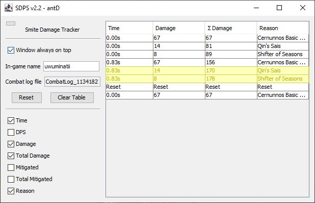

# SDPS

A handy tool to calculate DPS in the game [Smite](https://smitegame.com/). SDPS uses the in-game
combat log, so this tool will work seamlessly with future updates containing balance changes, new
gods, and new items.

## Usage

1. In the Smite chat, enter `/combatlog toggle piped` to let SDPS see your combat log. You can type
   the command in at any time. It doesn't matter if you are on the main menu or already in a match.
   Every time Smite is closed, the command has to be typed in again.
2. Extract the zip file and run `SDPS.exe` to start the program.
3. Enter your Smite in-game name and press enter. Optionally, if you click the save icon, your name
   will be saved for the next time you open the tool.
4. SDPS will begin tracking your damage done in that match. After your first tick of damage, any
   time you do damage after that, a new row will be added to the table with your DPS calculated from
   your first tick of damage to the most recent.
5. If you press "Reset DPS Timer" your next tick of damage will once again count as the first hit
   used in the DPS calculations going forward.
6. For convenience I've added a "Clear Log" button, "Window always on top" setting, and a sidebar
   minimize button in the top left corner. By setting your Smite "Screen Type" setting to
   "Borderless Window" or "Window", you can have the tool window display on top of the game and
   makes DPS testing considerably easier.

## Notes

- **This one is fairly important** depending on the type of scenario you are trying to measure the
  DPS of, particularly burst DPS. If there are multiple ticks of damage that occur at the same time
  (e.g. Qin's Sais), Smite's combat log annoyingly won't be updated until the next tick of damage.
  The late timing won't mess up the DPS calculation, but this issue can make the DPS output
  misleading. The following screenshots show an example of two ticks of damage arriving late to the
  DPS log.

  
  
  There are two missing rows of damage from Qin's Sais and Shifter of Seasons that occurred at the
  same time as the last shown basic attack. These rows are not added until the combat log is
  updated.

  

- In the "Odin bots" section of jungle practice, there are three Odin bots to the immediate left.
  These bots are handy for DPS calculations. The first one matches your character's level, the
  second one is level one, and the third one is level twenty. There are also buttons to the right
  that let you control the amount of protections they have.

- If the the calculator log is empty when you don't expect it to be, make sure your in-game name is
  typed in correctly and then press enter to update the calculator.

- If you are in a match and the calculator log says "End of file. Searching...", try typing the
  command `/combatlog toggle piped` into Smite chat again. You may have accidentally entered it
  twice which prevents SDPS from monitoring your combat log.

## Compiling

Run `./gradlew jar` on Windows or `gradle jar` on Linux. The output is located in `build/libs`.

## Screenshots

 

## Copyright and License

Copyright © 2021 antD97  
Licensed under the [MIT License](LICENSE)
